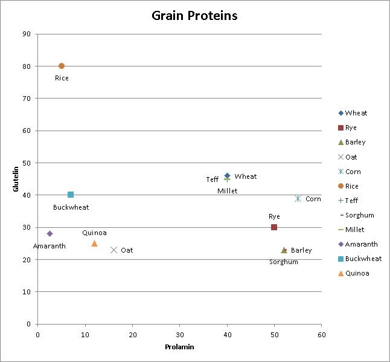

## Grain Relationship

I was trying to figure out, biologically, how different are all the grains?

Is there a way to compare them on some kind of spectrum? Which grains are the most different from each other?

If I want to eat the most diverse set of grains, which gains are the most different from each other?

After a bit of searching, I found that you can compare grains based on their protein.

I found two main proteins, Glutelin and Prolamin, that vary among grains.

So.. I put them into excel and built a chart of grains..

Data Source: https://paleofoundation.com/grains-and-pseudograins/
